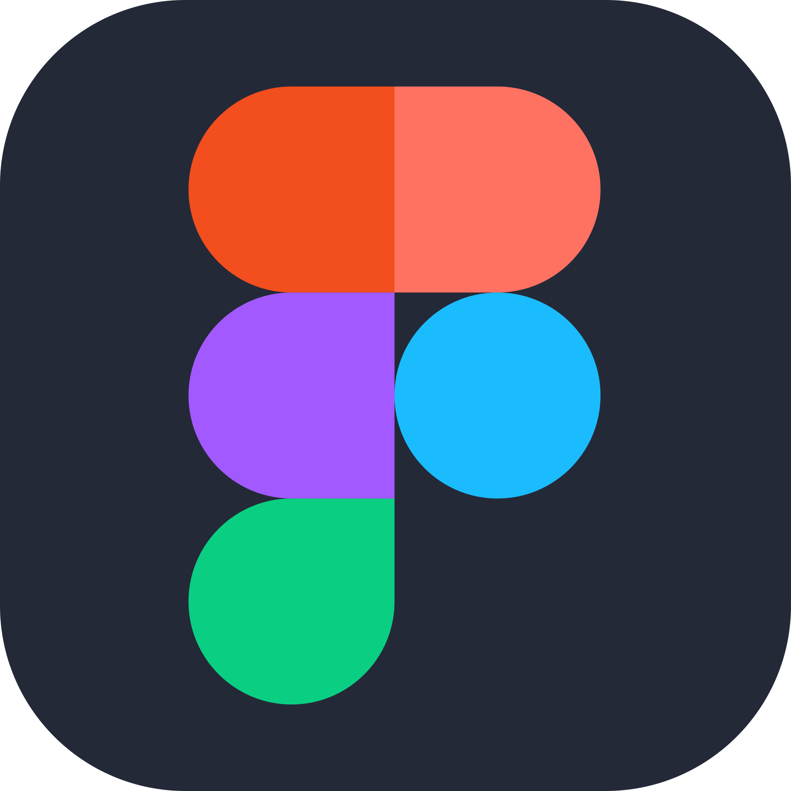

### Welcome to my GitHub page! 👋

## Languages & Tools I use:

## Ways to reach me:

</a>

## My Projects
| Course                                                                                                    | Repository                                                                                                                                                                                                                                                                                                                                                                                                                          | Certificate                                                            |
|-----------------------------------------------------------------------------------------------------------|-------------------------------------------------------------------------------------------------------------------------------------------------------------------------------------------------------------------------------------------------------------------------------------------------------------------------------------------------------------------------------------------------------------------------------------|------------------------------------------------------------------------| 
| [QA Guru Test Automation School](https://qa.guru/)                                                        |   |  Coming soon 😄|
| [SkillFactory Java QA Engineer](https://skillfactory.ru/java-qa-engineer-testirovshik-po)                 |                                                                                                                                                                                                                     | [Certificate Link](https://drive.google.com/file/d/1PCjuiV8ppq7Fwinf5yeXRiWhNlT8zmyU/view?usp=drive_link)  |

## My Stats

  
  
  
  

